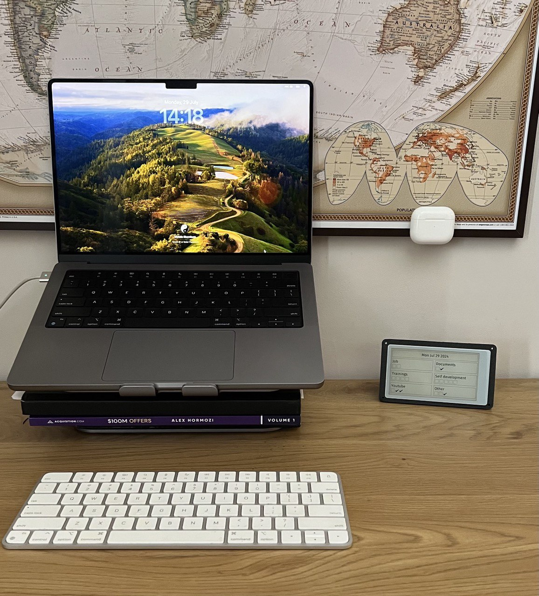
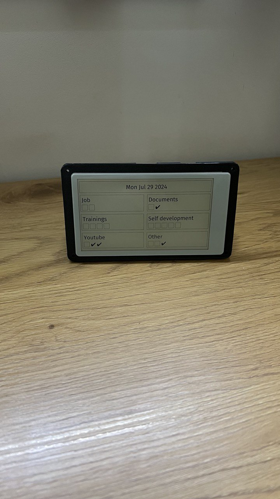
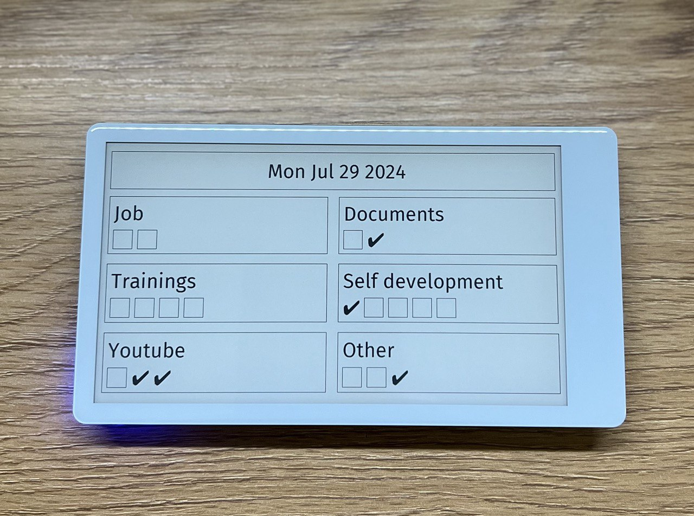
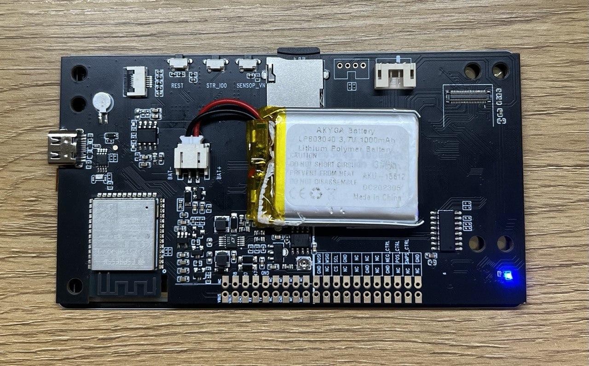
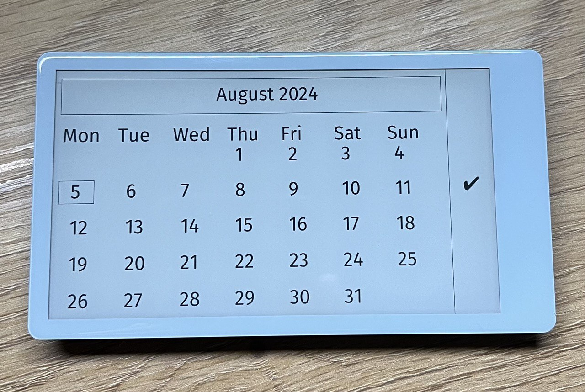

### ToDo APP based on the Liliygo T5 4.7 inch epaper display
## [Lligo T5 e-Paper 4.7 Inch ESP32-S3 Development Driver Board](http://www.lilygo.cc/products/t5-4-7-inch-e-paper-v2-3)

### 05/08/2024
- added calendar page

### 29/07/2024
- todo list with SD datastorage and open API under http://showorld.local/todo
- http://showorld.local/todo GET - fetch all the todo items
- http://showorld.local/todo POST - update all todo items at once
- 6 topics to manage your life
- up to 8 todo items within the topic
- todo item with done/undone functionality
- switch between the topics
